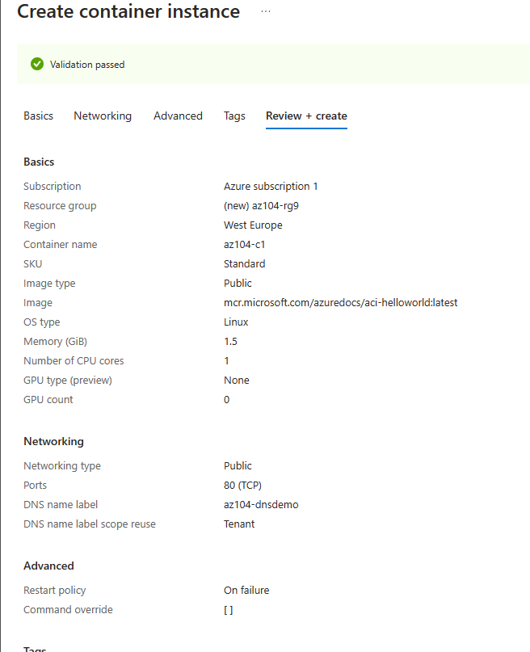
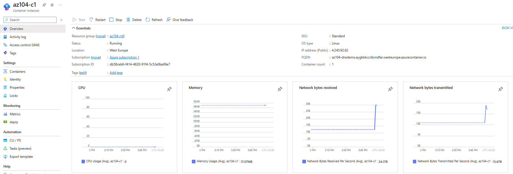

---
lab:
    title: 'Lab 09b: Implement Azure Container Instances'
    module: 'Administer PaaS Compute Options'
---

# Lab 09b - Implement Azure Container Instances

## Lab introduction

In this task, I made a simple web application using Docker image.
## Lab scenario

Your organization has a web application that runs on a virtual machine in your on-premises data center. The organization wants to move all applications to the cloud but doesn't want to have a large number of servers to manage. You decide to evaluate Azure Container Instances and Docker.

## Tasks:

+ Task 1: Deploy an Azure Container Instance using a Docker image.
+ Task 2: Test and verify deployment of an Azure Container Instance.

### Diagram of the Lab

### Deploying an Azure Container Instance using a Docker image.

In this task, I configured azure container instance using Azure Portal.

### Testing and verifying deployment of an Azure Container Instance.

In this task, I review the container instance. Azure Container Instance is accessibile over port 80 so I navigated to the container
using the DNS name that I provided in the previous task.

## Key takeaways
+ Azure Container Instances (ACI) is a service that enables you to deploy containers on the Microsoft Azure public cloud.
+ ACI doesn't require you to provision or manage any underlying infrastructure.
+ ACI supports both Linux containers and Windows containers.
+ Workloads on ACI are usually started and stopped by some kind of process or trigger and are usually short-lived. 
