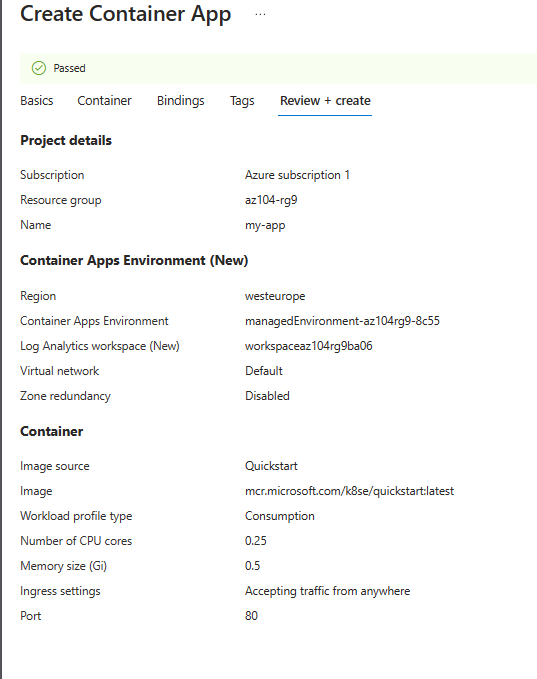
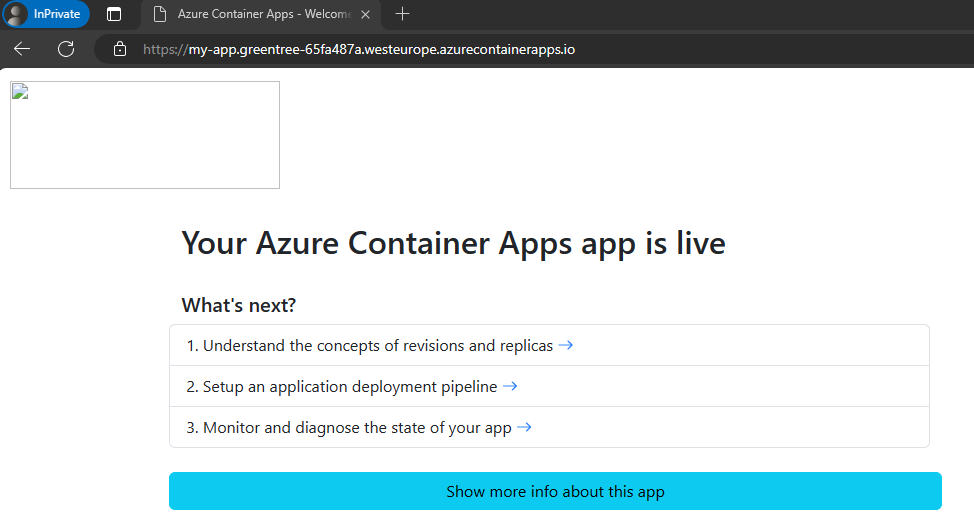

---
lab:
    title: 'Lab 09c: Implement Azure Container Apps'
    module: 'Administer PaaS Compute Options'
---

# Lab 09c - Implement Azure Container Apps

## Lab introduction

In this task, I moved applications to the Azure Cloud. I used Azure Container Apps
to finish this simple and short task.

## Lab scenario

Your organization has a web application that runs on a virtual machine in your on-premises data center. The organization wants to move all applications to the cloud but doesn't want to have a large number of servers to manage. You decide to evaluate Azure Container Apps.

## Tasks:

+ Task 1: Create and configure an Azure Container App and environment.
+ Task 2: Test and verify deployment of the Azure Container App.

### Diagram of the Lab

### Creating and configuring an Azure Container App and environment.

In this task, I configured Azure Container App using Azure Portal.

### Testing and verifying deployment of the Azure Container App.
In this task, I used the applications URL to test if the Container App is working.

## Key takeaways

+ Azure Container Apps (ACA) is a serverless platform that allows you to maintain less infrastructure and save costs while running containerized applications.
+ Container Apps provides server configuration, container orchestration, and deployment details. 
+ Workloads on ACA are usually long-running processes like a Web App.
