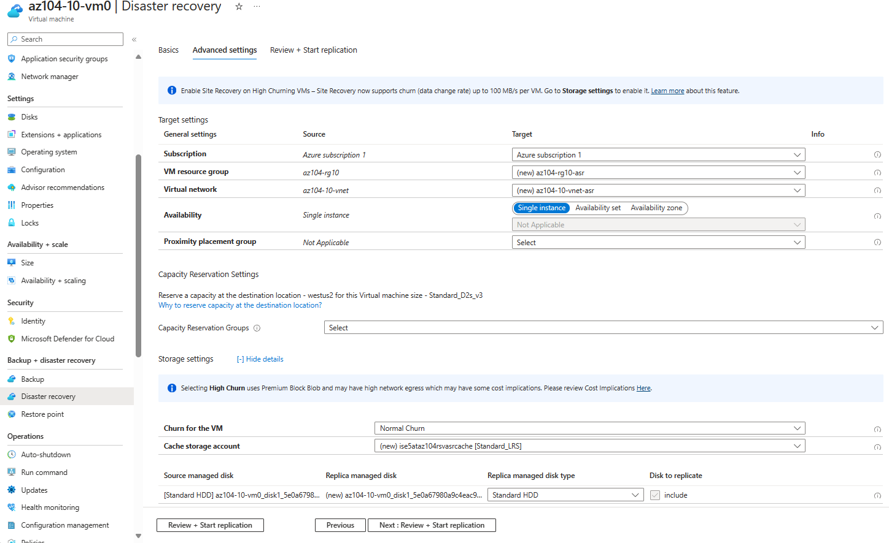

---
lab:
    title: 'Lab 10: Implement Data Protection'
    module: 'Administer Data Protection'
---

# Lab 10 - Implement Data Protection

## Lab introduction

In this task, I moved applications to the Azure Cloud. I used Azure Container Apps
to finish this simple and short task.

## Lab scenario

Your organization is evaluating how to backup and restore Azure virtual machines from accidental or malicious data loss. 
Additionally, the organization wants to explore using Azure Site Recovery for disaster recovery scenarios. 

## Tasks:

+ Task 1: Use a template to provision an infrastructure.
+ Task 2: Create and configure a Recovery Services vault.
+ Task 3: Configure Azure virtual machine-level backup.
+ Task 4: Monitor Azure Backup.
+ Task 5: Enable virtual machine replication. 

### Diagram of the Lab 10

### Using a template to provision an infrastructure.
In this task, I deployed a template provided by Microsoft using "Deploy a custom template" resource
via Azure Portal.

### Creating and configuring a Recovery Services vault.
In this task, I created a Recovery Services vault. I also configured blades such as Security Settings and Backup Configuration.

### Configuring Azure Virtual machine-level backup.
In this task, I configured a backup for Azure Virtual Machine.
I also created a new policy, where I configured backup schedule that was more fit for my timezone.

### Monitoring Azure Backup.
In this task, I deployed an Azure Storage Account. After creating a Storage Account, I configured the vault that sends logs and metrics to
azure storage account.

When I wanted to save configuration, I received an error that you will see on the screenshot.

After seeing this error, I had to research to see what can fix this. I used Azure Portal
to create, find resource with insights. I created Application Insights and that fixed the problem that I received
in this task.

### Enabling virtual machiune replication.
In this task, I created again the Recovery Services vault, but this time I configured
it with the different region from my first Virtual Machine. I decided to go with West US.

I used the VM that was created with the template and configured Backup + Disaster Recovery.

Deployment and recovery took time but there is also a screenshot of the storage account.

## Key takeaways

+ Azure Backup service provides simple, secure, and cost-effective solutions to back up and recover your data.
+ Azure Backup can protect on-premises and cloud resources including virtual machines and file shares.
+ Azure Backup policies configure the frequency of backups and the retention period for recovery points. 
+ Azure Site Recovery is a disaster recovery solution that provides protection for your virtual machines and applications.
+ Azure Site Recovery replicates your workloads to a secondary site, and in the event of an outage or disaster, you can failover to the secondary site and resume operations with minimal downtime.
+ A Recovery Services vault stores your backup data and minimizes management overhead.
